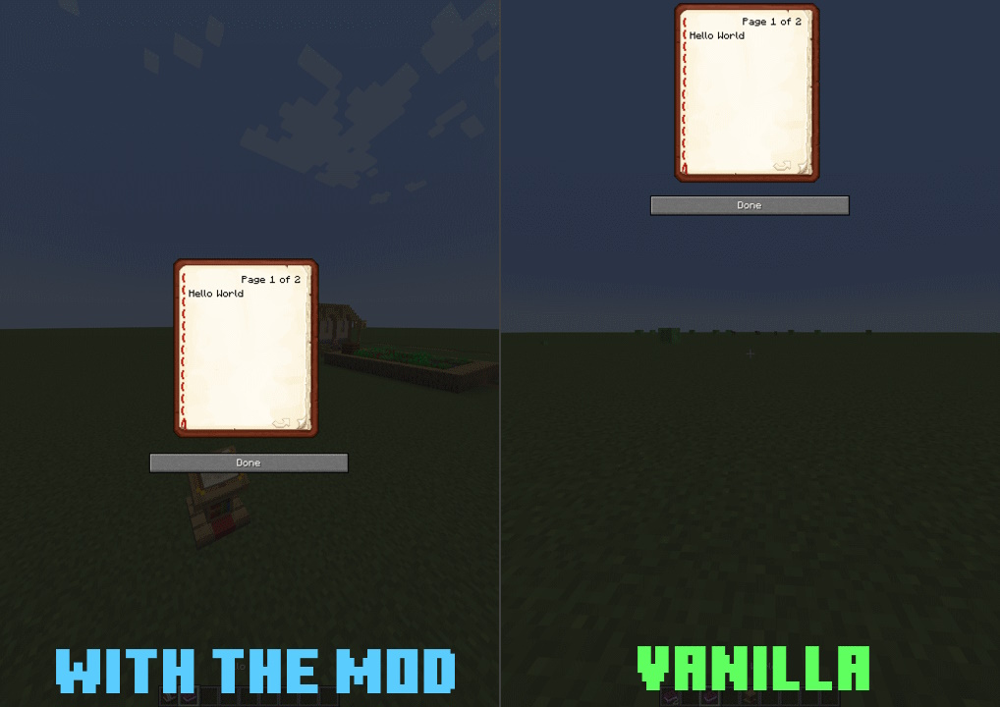
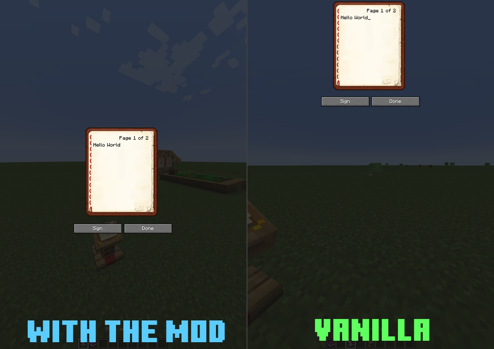
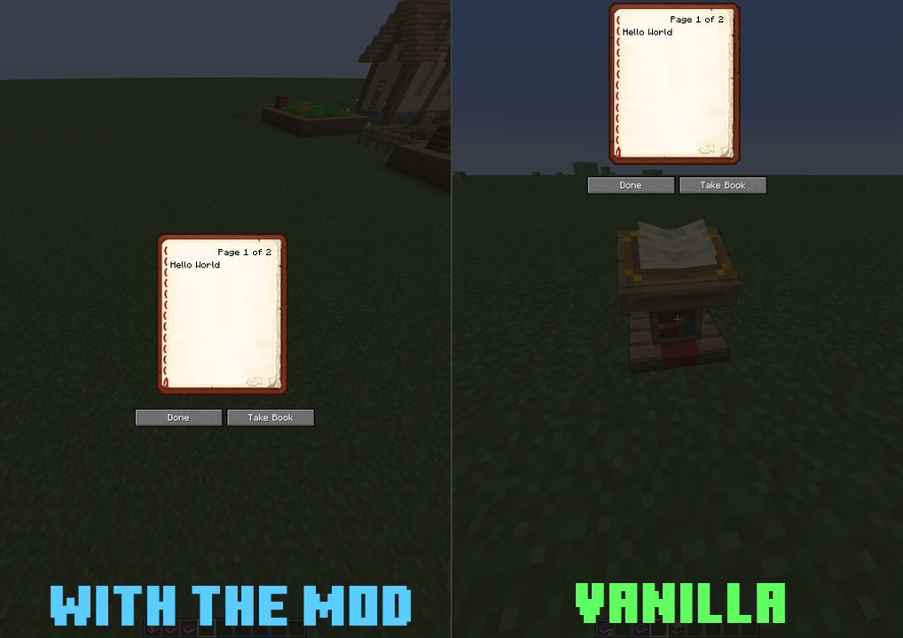

# Fix book gui

This mod intent to fix [MC-61489](https://bugs.mojang.com/projects/MC/issues/MC-61489)

Most of the fix come from [mworzala's gist](https://gist.github.com/mworzala/9a8d86803784c9c81aac77d9a7f9fb2b) so credit
to them for the fix, I just made it a mod. (They are not involved in the creation of it)

### Comparison

    <table>
        <tr>
            <td align="middle">
            
            <figcaption align="middle">Book</figcaption>
            </td>
        </tr>
        <tr>
            <td align="middle">
                
                <figcaption align="middle">Writing book</figcaption>
            </td>
        </tr>
        <tr>
            <td align="middle">
                
                <figcaption align="middle">Lectern</figcaption>
            </td>
        </tr>
    </table>

