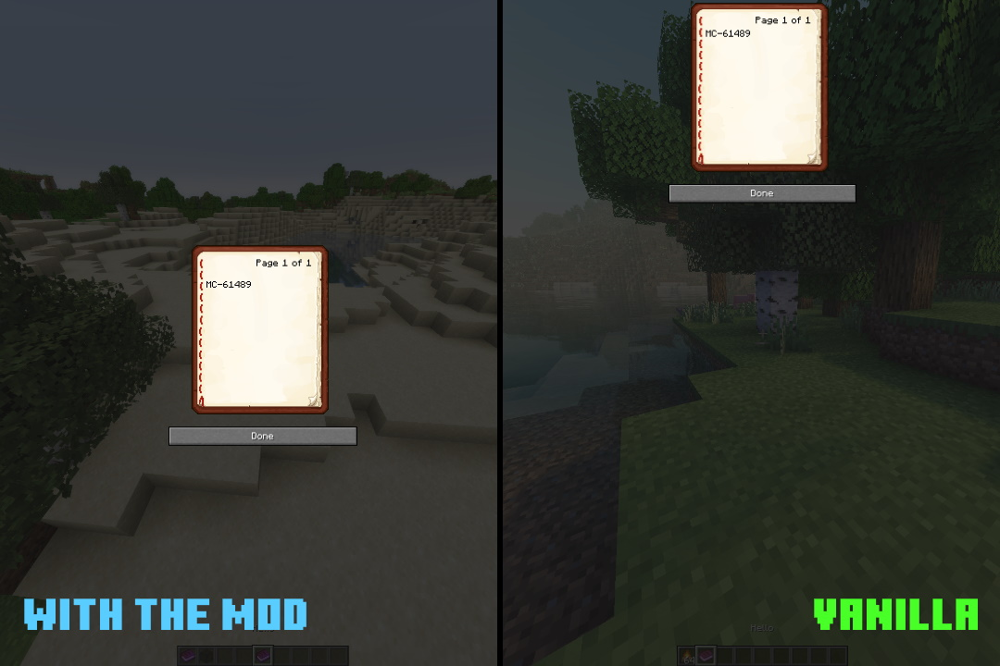

# Fix book gui
This mod intent to fix [MC-61489](https://bugs.mojang.com/projects/MC/issues/MC-61489)

This mod is more a POC and a little project to learn who mixin works than a real thing, but it works.

I haven't fixed the gui when you write a book, maybe one day if Mojang still hasn't fixed it I will.

Most of the fix come from [mworzala's gist](https://gist.github.com/mworzala/9a8d86803784c9c81aac77d9a7f9fb2b) so credit to him for the fix, I just made it a mod. (He is not involved in the creation of this mod)

Need [Fabric API](https://www.curseforge.com/minecraft/mc-mods/fabric-api) to work.

### Comparisons
